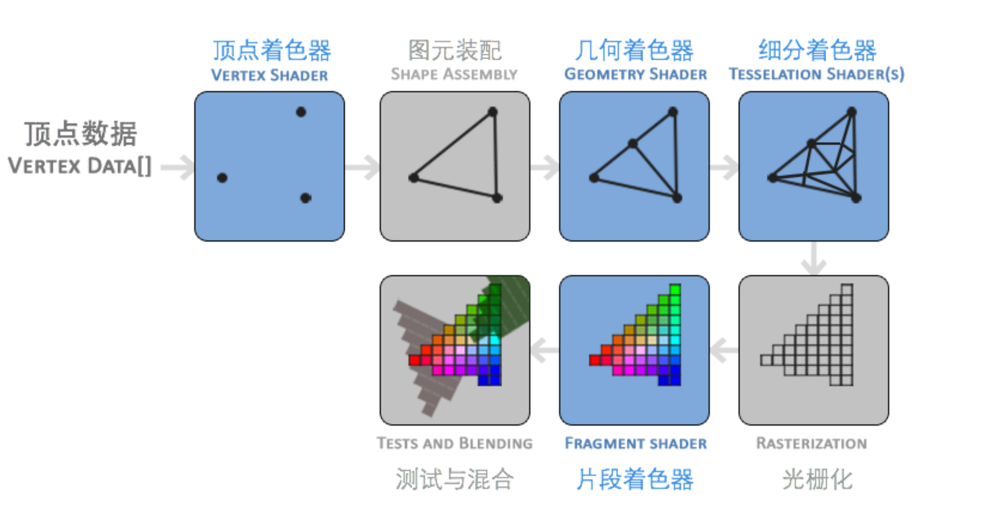
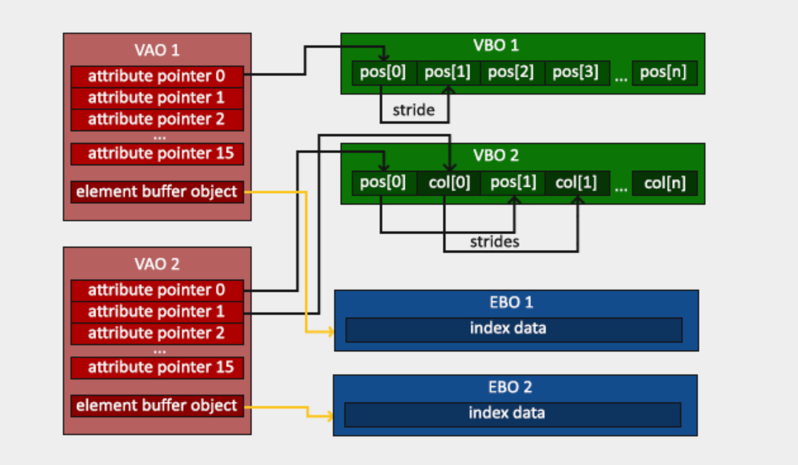

---
layout:       post
title:        "opengl basic"
author:       "shensunbo"
header-style: text
catalog:      true
tags:
    - opengl
---
# basic
## pipeline


## VAO 和 VBO
1. VBO 在GPU中存贮顶点数据等
2. VAO 描述VBO的属性，如何访问VBO中的数据

## EBO 索引缓冲对象
存储 VBO 中顶点的索引, 减少了内存占用和数据传输量

```
// 1. 生成 VAO 和 VBO ID
unsigned int VAO, VBO, EBO;
glGenVertexArrays(1, &VAO);
glGenBuffers(1, &VBO);

// 2. 绑定 VAO
glBindVertexArray(VAO); // 所有后续的顶点属性配置将存储到这个 VAO 中

// 3. 绑定 VBO 并上传数据 (这个 VBO 现在被 VAO 记录下来了)
glBindBuffer(GL_ARRAY_BUFFER, VBO);
glBufferData(GL_ARRAY_BUFFER, sizeof(vertices), vertices, GL_STATIC_DRAW);

// 4. 绑定 EBO 并上传索引数据
// 注意：EBO 绑定到 GL_ELEMENT_ARRAY_BUFFER，其状态会存储在当前绑定的VAO中
    glBindBuffer(GL_ELEMENT_ARRAY_BUFFER, EBO);
    glBufferData(GL_ELEMENT_ARRAY_BUFFER, sizeof(indices), indices, GL_STATIC_DRAW);

// 5. 配置顶点属性 (这些配置也存储到当前绑定的 VAO 中)
// 假设顶点数据是 {x, y, z, r, g, b}
// 位置属性 (属性索引 0)
// 在着色器中对应layout (location = 0) in vec3 aPos;
glVertexAttribPointer(0, 3, GL_FLOAT, GL_FALSE, 6 * sizeof(float), (void*)0);
glEnableVertexAttribArray(0);

// 颜色属性 (属性索引 1)
// 在着色器中对应layout (location = 1) in vec3 aColor;
glVertexAttribPointer(1, 3, GL_FLOAT, GL_FALSE, 6 * sizeof(float), (void*)(3 * sizeof(float)));
glEnableVertexAttribArray(1);

// 5. 解绑 VAO 和 VBO (这是一个好习惯，避免意外修改)
glBindBuffer(GL_ARRAY_BUFFER, 0);
glBindVertexArray(0);

// --- 在渲染循环中 ---
// 只需要绑定 VAO 即可
glBindVertexArray(VAO);
glDrawArrays(GL_TRIANGLES, 0, numVertices);
// 或 glDrawElements(GL_TRIANGLES, numIndices, GL_UNSIGNED_INT, 0); 如果你使用了 EBO

// 解绑 VAO (可选，但推荐)
glBindVertexArray(0);

```

## UBO
UBO（Uniform Buffer Object）是一种特殊的缓冲对象（Buffer Object），它允许我们将一组Uniform变量打包到一个缓冲区中，然后将这个缓冲区绑定到着色器中的一个Uniform块（Uniform Block）上。

1. 减少 `glUniform*` API调用
2. 多个着色器中共享

着色器代码示例：
```
// GLSL Shader
layout (std140) uniform Matrices {
    mat4 projection;
    mat4 view;
};

layout (std140) uniform Lights {
    vec4 lightPosition;  // 推荐选择声明为vec4，因为即使是vec3也是占用16字节，容易导致错误
    vec3 lightColor;
    float ambientStrength;
};

//访问
Matrices.projection
Lights.lightPosition.xyz
```

应用代码：
```
struct LightST {
    glm::vec4 lightPosition;
    glm::vec4 lightColor;
    float ambientStrength;
};

glGenBuffers(1, &UBO);
glBindBuffer(GL_UNIFORM_BUFFER, UBO);
glBufferData(GL_UNIFORM_BUFFER, sizeof(LightST), nullptr, GL_STATIC_DRAW);
glBindBuffer(GL_UNIFORM_BUFFER, 0);

glBindBufferBase(GL_UNIFORM_BUFFER, 0, UBO);
// glBindBufferRange(GL_UNIFORM_BUFFER, 1, UBO_LightProps, 0, 3 * 4 * sizeof(float));
//Calling glBindBufferBase is equivalent to calling glBindBufferRange with offset zero and size equal to the size of the buffer.

unsigned int matricesBlockIndex_Shader1 = glGetUniformBlockIndex(shaderProgram1.ID, "Lights");
glUniformBlockBinding(shaderProgram1.ID, matricesBlockIndex_Shader1, 0);

// 更新Matrices UBO
LightST lightSt{};
glBindBuffer(GL_UNIFORM_BUFFER, UBO);
glBufferSubData(GL_UNIFORM_BUFFER, 0, sizeof(LightST), glm::value_ptr(lightSt)); // 更新projection
glBindBuffer(GL_UNIFORM_BUFFER, 0);
```
